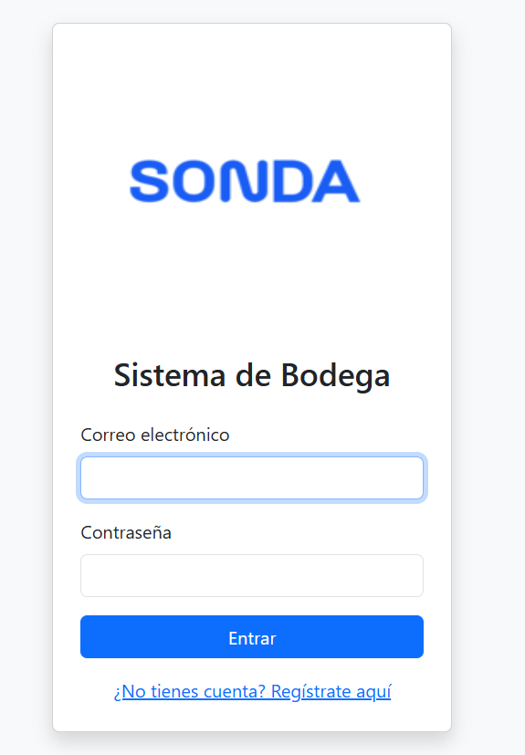
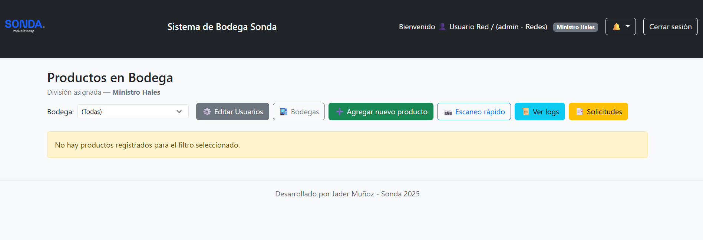
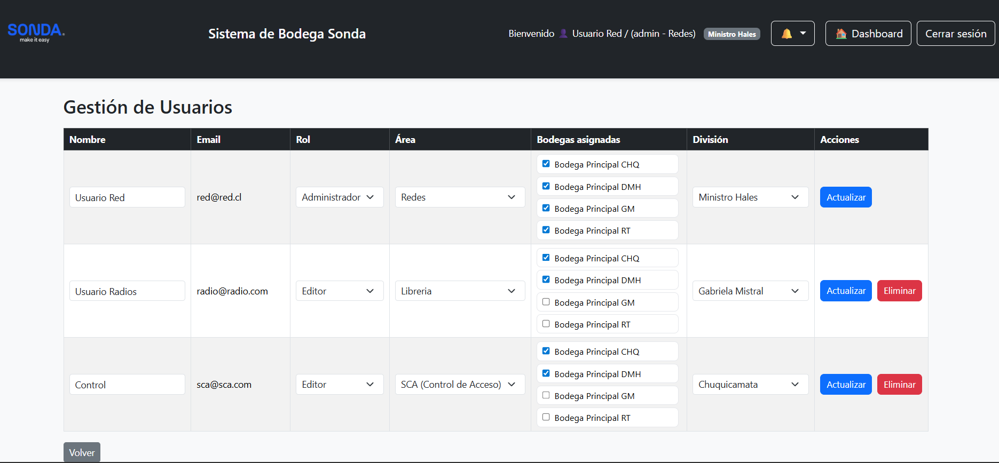
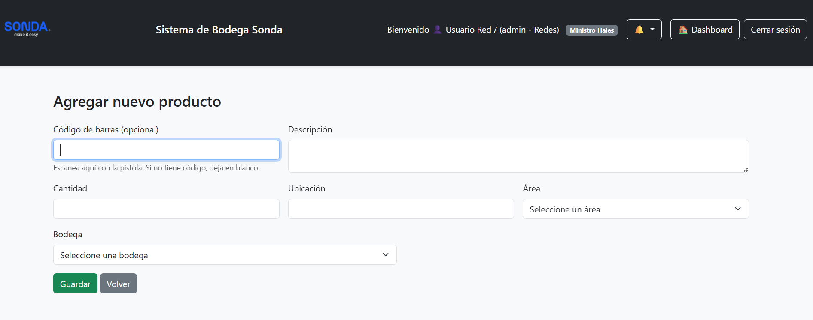
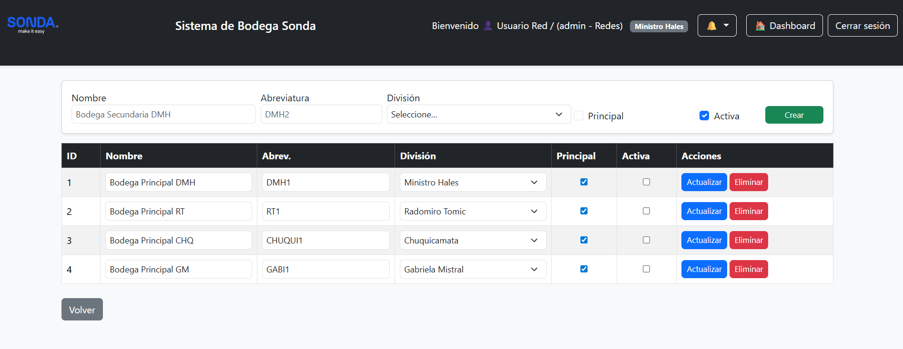

# 🏭 Sistema de Bodega SONDA

Aplicación web desarrollada en **PHP + MySQL + Bootstrap**, diseñada para la gestión de productos, bodegas y solicitudes internas dentro de la organización.  
Incluye control de usuarios por roles y ahora, soporte completo para **divisiones y bodegas por división**.

---

## 🚀 Características principales

### 🔐 Login de usuarios

# Vista del Panel Principal


# Vista del Panel Principal


### 🔐 Gestión de usuarios
- Registro e inicio de sesión con roles:
  - `admin` → controla usuarios, divisiones, bodegas, logs.
  - `editor` → puede editar productos y solicitudes.
  - `viewer` → solo visualiza información.
- Control de acceso por **área** (`Radios`, `Redes`, `SCA`, `Librería`).
- Asignación de usuarios a bodegas específicas (tabla `user_bodegas`).

# Vista del Panel Gestion de Usuario



### 📦 Gestión de productos
- CRUD completo de productos.
- Asignación por **bodega** y **área**.
- Soporte para importación desde Excel (`importar_excel.php`).
- Búsqueda, filtros y códigos de barra (`scan_barcode.php`).

# Vista del Panel Agregar Producto



### 🏗️ Nueva estructura jerárquica
Desde la última versión se agregó un modelo jerárquico entre **Divisiones → Bodegas → Productos**:

#### 🔹 Divisiones
Tabla `divisiones` define las unidades principales de la empresa:

CHQ → Chuquicamata
RT → Radomiro Tomic
DMH → Ministro Hales
GM → Gabriela Mistral


#### 🔹 Bodegas
Cada división puede tener una o varias bodegas:
- `is_principal`: indica la bodega principal de la división.
- `activa`: permite desactivar bodegas sin eliminarlas.
- Cada producto y usuario se puede asociar a una bodega específica.

Estas se administran desde el nuevo módulo **`admin_bodegas.php`**, enlazado al dashboard del administrador.

# Vista del Panel Administrar Bodegas


---

## ⚙️ Instalación paso a paso

### 1️⃣ Clonar el repositorio
```bash
git clone https://github.com/jaderkamui/bodega
cd bodega_sonda

2️⃣ Configurar conexión a base de datos

Edita el archivo:

config/db.php


y ajusta tus credenciales:

$host = 'localhost';
$dbname = 'bodega_sonda';
$user = 'root';
$pass = '';

3️⃣ Crear la base de datos

Ejecuta el script estructura.sql incluido en el proyecto (desde phpMyAdmin o CLI):

SOURCE estructura.sql;


Este archivo contiene la estructura completa actualizada con divisiones, bodegas, productos, usuarios, logs, solicitudes y relaciones.

4️⃣ Crear usuario administrador inicial
INSERT INTO users (username, email, password, role, area, division, division_id)
VALUES ('admin', 'admin@local', '$2y$10$ABC123HASH...', 'admin', 'Redes', 'CHQ', 1);


Puedes generar un hash bcrypt para la contraseña ejecutando en PHP:

echo password_hash('tu_clave', PASSWORD_BCRYPT);

5️⃣ Ejecutar el sistema

Abre en el navegador:

http://localhost/bodega_sonda/

🧱 Estructura del proyecto
bodega_sonda/
│
├── admin_bodegas.php         # Nuevo módulo: gestión de bodegas por división
├── admin_usuarios.php        # Administración de usuarios
├── admin_solicitudes.php     # Aprobación y control de solicitudes
├── agregar_producto.php      # Crear producto
├── editar_producto.php       # Editar producto
├── eliminar_producto.php     # Eliminar producto
├── importar_excel.php        # Carga masiva de productos desde Excel
├── dashboard.php             # Panel principal
├── ver_logs.php              # Auditoría del sistema
├── ver_notificaciones.php    # Notificaciones internas
├── estructura.sql            # Script completo de base de datos
├── config/
│   └── db.php                # Configuración de conexión
└── assets/                   # Logos, CSS y recursos estáticos

🧩 Esquema relacional simplificado
divisiones (1) ────< bodegas (N) ────< products (N)
        │                     │
        │                     └──< user_bodegas (N:N) >── users (N)
        │
        └──< logs, solicitudes, notificaciones

🧾 Logs y auditoría

Todas las acciones importantes quedan registradas en la tabla logs, incluyendo:

Creación / actualización / eliminación de bodegas.

Cambios en productos o solicitudes.

Acciones de administradores sobre usuarios.

Puedes revisarlas desde ver_logs.php.

📜 Licencia

Este proyecto se distribuye bajo la licencia MIT.
Desarrollado por Jader Muñoz.
